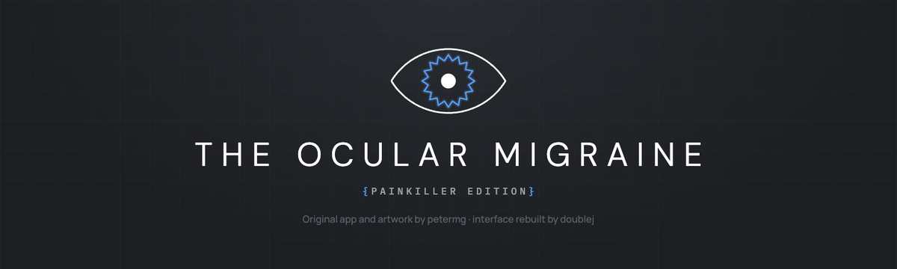

# The Ocular Migraine: Painkiller Edition

A native Android app for managing Meta Quest VR headsets (Quest 1/2/3/Pro). Controls device settings via ADB shell commands — resolution, refresh rate, CPU/GPU levels, recording, app management, and more.

## Credits

The Ocular Migraine was created by [petermg](https://github.com/petermg/TheOcularMigraineMCP). All credit for the concept, feature design, ADB command research, and the exhaustive work mapping every Quest setting to its `debug.oculus.*` property goes to him. His original Tasker-based app is genuinely one of the most feature-complete Quest management tools out there — it does things no other app bothers to do.

This fork is a UI rebuild using Svelte 5 + Capacitor. The feature set is identical; the only thing that changed is the interface.

The mark above is an homage to his banner art, not a replacement for it: his vesica eye and his blazing core, with the sunburst redrawn as a fortification spectrum — the shape an ocular migraine aura actually takes. `tools/gen-icons.py` renders it into every icon and splash screen; `docs/label.html` is the source of the label itself.

## Features

- Change headset resolution (presets from Low to Max, or custom)
- Change CPU level (0–5), static or dynamic
- Change GPU level (0–5), static or dynamic
- Change Fixed Foveated Rendering level (0–4), static or dynamic
- Change refresh rate (60/72/90/120 Hz)
- Game profiles — save and auto-apply settings per game
- Recording controls — resolution, bitrate, framerate, eye selection, FOV crop
- 3D metadata injection for YouTube VR uploads
- App management — install APKs, kiosk mode, startup app, access control
- Web server for file sharing/uploading
- ADB console for direct shell access
- Settings backup and restore

## Tech Stack

- **Svelte 5** with runes for reactive state
- **Capacitor 8** for native Android wrapping
- **Vite 6** for builds
- Custom **ShellExec** Capacitor plugin using `Runtime.exec()` for on-device shell commands

## Development

```bash
bun run dev      # Start dev server (localhost:5173)
bun run build    # Production build
bun run check    # Type checking
./deploy.sh      # Build + deploy to Quest via Windows relay
```

## License

See [LICENSE.txt](LICENSE.txt).
